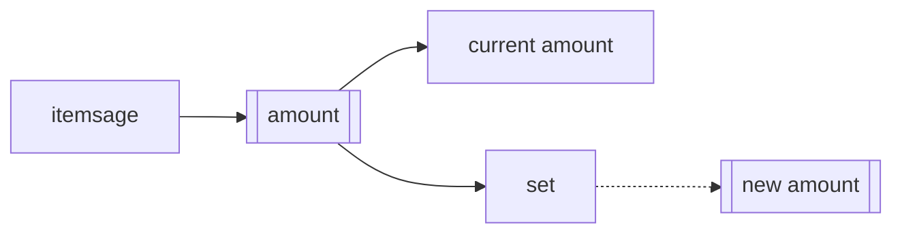
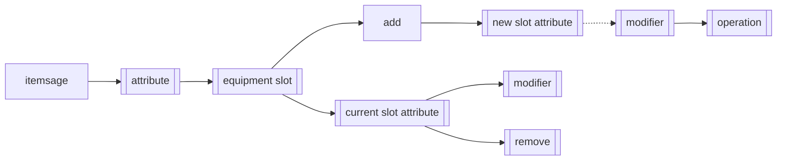
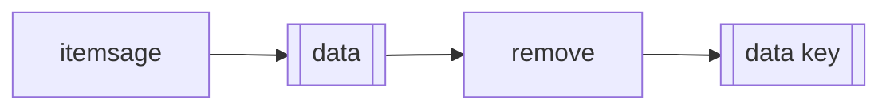
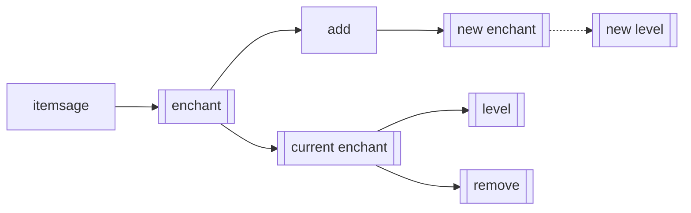
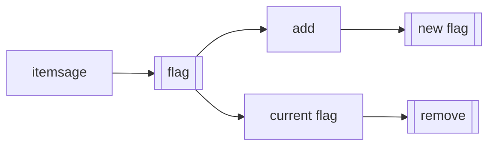
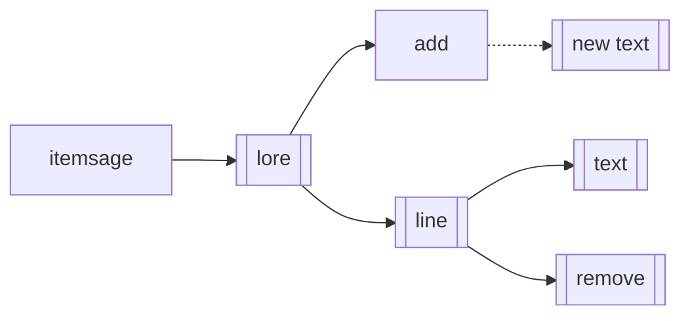
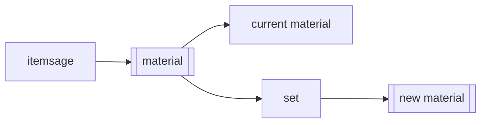
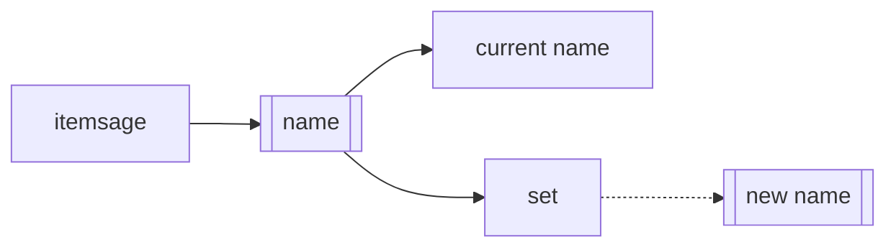
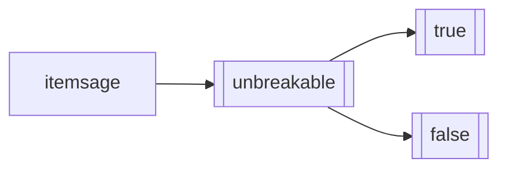
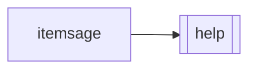

# ItemSage

"_Even if he all can see,\
he would not talk, and that may be.\
But if a glimpse you want to take,\
a set of rules you shall not break._"

A simple way to modify anything about your items!

To interact with the ItemSage you will need to learn its commands.

## Commands
To interact with the **item** in your **main hand**, you have to use the 
`/itemsage` command, which is the main entrypoint to use the plugin's functions.

The **permission** to use the command is `itemsage.command`.

> Key: [something] means that you should put something there
> (ex. [equipment slot] should be replaced with HAND, HEAD, CHEST, etc...).

Graph key

> - If the square has two vertical lines inside, the command can be entered in chat as it is valid.
> - Dotted lines refer to a path that is not TabCompletable but can still be entered.

### 🧮 Amount
| Command                         | Action                        |
|:--------------------------------|:------------------------------|
| `/itemsage amount `             | Display the amount.           |
| `/itemsage amount set [amount]` | Set the amount to `[amount]`. |

 Command graph 

### ⚜️ Attribute
| Command                                                                       | Action                                                                                                                   |
|:------------------------------------------------------------------------------|:-------------------------------------------------------------------------------------------------------------------------|
| `/itemsage attribute`                                                         | Display all of the attributes.                                                                                           |
| `/itemsage attribute [equipment slot]`                                        | Display all the attributes of the `[equipment slot]`.                                                                    |
| `/itemsage attribute [equipment slot] [attribute]`                            | Display the `[attribute]` of the `[equipment slot]`.                                                                     |
| `/itemsage attribute [equipment slot] [attribute] [modifier]`                 | Sets the `[modifier]` to the `[attribute]` of the `[equipment slot]`, you can't modify the operation.                    |
| `/itemsage attribute [equipment slot] [attribute] remove`                     | Remove the `[attribute]` of the `[equipment slot]`.                                                                      |
| `/itemsage attribute [equipment slot] add [attribute]`                        | Adds the `[attribute]` with the default modifier (1) and default operation (ADD_NUMBER) to the `[equipment slot]`.       |
| `/itemsage attribute [equipment slot] add [attribute] [modifier]`             | Adds the `[attribute]` with the corresponding `[modifier]` and default operation (ADD_NUMBER) to the `[equipment slot]`. |
| `/itemsage attribute [equipment slot] add [attribute] [modifier] [operation]` | Adds the `[attribute]` with the corresponding `[modifier]` and `[operation]` to the `[equipment slot]`.                  |

 Command graph 

### 📈 Data
| Command                       | Action                            |
|:------------------------------|:----------------------------------|
| `/itemsage data`              | Display the data key(s).          |
| `/itemsage data remove [key]` | Remove the `[key]` from the data. |

 Command graph 

### 🛡 Durability
| Command                                 | Action                                |
|:----------------------------------------|:--------------------------------------|
| `/itemsage durability`                  | Display the durability.               |
| `/itemsage durability set [durability]` | Set the durability to `[durability]`. |

 Command graph 

### 🔮 Enchant
| Command                                       | Action                                             |
|:----------------------------------------------|:---------------------------------------------------|
| `/itemsage enchant`                           | Display the enchantment(s).                        |
| `/itemsage enchant [enchantment]`             | Display the `[enchantment]`.                       |
| `/itemsage enchant [enchantment] [level]`     | Set the level of the `[enchantment]` as `[level]`. |
| `/itemsage enchant [enchantment] remove`      | Remove the `[enchantment]`.                        |
| `/itemsage enchant add [enchantment]`         | Add the `[enchantment]` with the first level.      |
| `/itemsage enchant add [enchantment] [level]` | Add the `[enchantment]` with the `[level]`.        |

 Command graph 

### 🚩 Flag
| Command                   | Action               |
|:--------------------------|:---------------------|
| `/itemsage flag`          | Display the flag(s). |
| `/itemsage add [flag]`    | Add the `[flag]`.    |
| `/itemsage [flag] remove` | Remove the `[flag]`. |

 Command graph 

### 📜 Lore
| Command                        | Action                                                              |
|:-------------------------------|:--------------------------------------------------------------------|
| `/itemsage lore`               | Display the lore.                                                   |
| `/itemsage lore [line]`        | Display the `[line]`.                                               |
| `/itemsage lore [line] [lore]` | Set the `[line]`'s text to `[lore]`.                                |
| `/itemsage lore [line] remove` | Remove the `[line]`, all of the following lines get bumped up once. |
| `/itemsage lore add [text]`    | Add the `[text]` as the last line.                                  |

 Command graph 

### 💎 Material
| Command                             | Action                            |
|:------------------------------------|:----------------------------------|
| `/itemsage material`                | Display the material.             |
| `/itemsage material set [material]` | Set the material to `[material]`. |

 Command graph 

### 🔖 Name
| Command                     | Action                    |
|:----------------------------|:--------------------------|
| `/itemsage name`            | Display the name.         |
| `/itemsage name set [name]` | Set the name to `[name]`. |

 Command graph 

### 🪬 Unbreakable
| Command                        | Action                                                |
|:-------------------------------|:------------------------------------------------------|
| `/itemsage unbreakable`        | Toggle unbreakable (false to true, true to false).    |
| `/itemsage unbreakable true`   | Set unbreakable to true.                              |
| `/itemsage unbreakable false`  | Set unbreakable to false.                             |

 Command graph 

### 🔧 Help
| Command          | Action                       |
|:-----------------|:-----------------------------|
| `/itemsage help` | Display a general help menu. |

Also: the help command just displays the commands already found here.

 Command graph 

## Support

You're having some issues with the plugin?\
Reach out to me via:
- Email (giopav012@gmail.com)
- Telegram (@Giopav)
